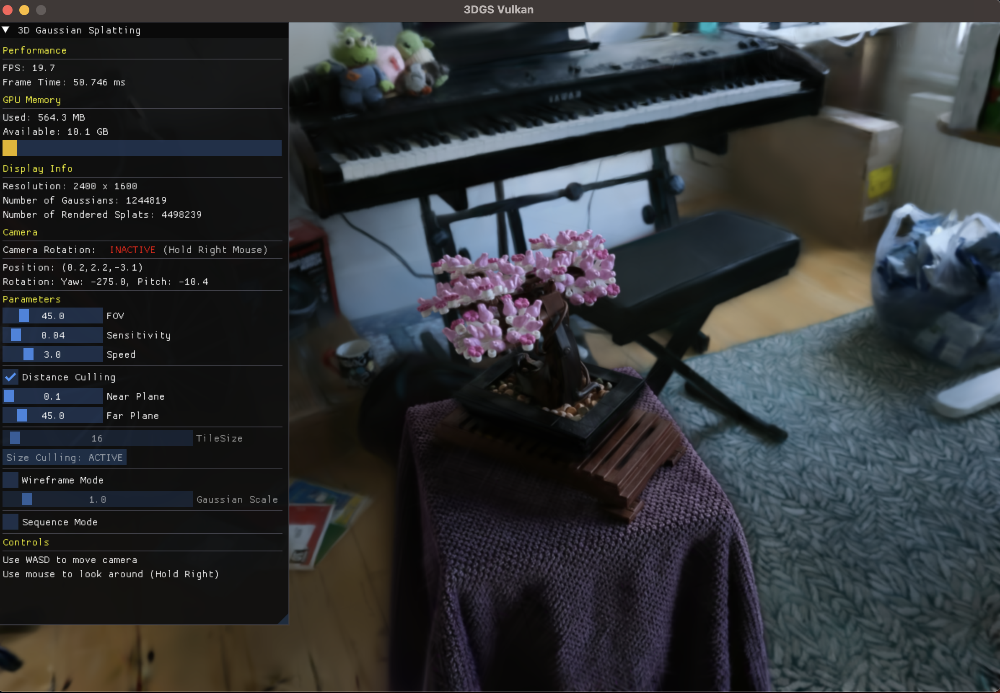

# Vulkan 3D Gaussian Splatting

Cross-platform 3D Gaussian Splatting implementation with KeyFrame Animation system using **pure Vulkan compute shaders** — no CUDA dependencies. Python support.


*Real-time rendering with keyframe animation system and configurable parameters on NVIDIA RTX 3060 ti*

---

**Example PLY**: https://huggingface.co/datasets/dylanebert/3dgs/tree/main/bonsai/point_cloud/iteration_30000
SH_DEGREE=3

Most 3DGS implementations rely on CUDA, locking them to NVIDIA GPUs. This project uses **standard Vulkan 1.3**, ensuring:

- ✅ **Cross-platform**: Runs on Windows, macOS, and Linux (Currently working to give support)
- ✅ **Any GPU vendor**: NVIDIA, AMD, Intel, Apple Silicon
- ✅ **Python Integration**: Bindings to run the renderer from python. For this, check [Vulkan 3dgs Python](https://github.com/AlejandroAmat/vulkan-3dgs-python)

     Note: For AMD change the SUBGROUP_SIZE to 64 in the [radix_sort/radixsort.comp shader](vulkan-3dgs/src/Shaders/radix_sort/radixsort.comp)
---

## Features

### Performance
- **High Performance**: 25-80 FPS on 2M+ Gaussians at 1800x1600 resolution
- **Real-time Interaction**: WASD + mouse camera control with immediate feedback

### Keyframe Animation System

**Camera Animation**:
- **Keyframe Recording**: Capture camera positions, rotations, and rendering parameters at specific time points
- **Smooth Interpolation**: Automatic interpolation between keyframes for cinematic camera movements
- **Playback Control**: Play, stop, and loop through your animation sequences
- **Parameter Animation**: Animate FOV, near/far planes, wireframe mode, and more

### Configurable Parameters

**Real-time Controls via ImGui**:
- **Camera Settings**:
  - FOV adjustment (30 - 120)
  - Mouse sensitivity (0.01 - 0.4)
  - Movement speed (1.0 - 10.0)
  
- **Rendering Options**:
  - Distance culling with adjustable near/far planes
  - Wireframe mode with Gaussian scale control
  - Real-time performance metrics (FPS, GPU memory)
  - Tile size configuration (currently fixed at 16)
  
- **Animation Keyframes Include**:
  - Camera position (X, Y, Z)
  - Camera rotation (Yaw, Pitch)
  - Field of View
  - Near/Far culling planes
  - Wireframe mode toggle
  - Timing control

---

## Building from Source

### Prerequisites
- **Vulkan SDK 1.3+** - Download from https://vulkan.lunarg.com/
- **macOS**: Install GLFW via Homebrew: `brew install glfw`
- **Compiler**: Visual Studio 2022 (Windows) or GCC/Clang (Linux/macOS)
- **CMake 3.16+**
- **Compatible GPU** with Vulkan support

### Step 1: Clone the Repository
```bash
git clone --recursive https://github.com/AlejandroAmat/3dgs-vulkan-cpp.git
cd 3dgs-vulkan-cpp
```

### Step 2: Create Build Directory
```bash
mkdir build
cd build
```

### Step 3: Configure with CMake
```bash
cmake ..
```

For Visual Studio users, specify the generator:
```bash
cmake -G "Visual Studio 17 2022" ..
```

### Step 4: Build the Project
```bash
# Release build (recommended)
cmake --build . --config Release

# Debug build
cmake --build . --config Debug
```

**Alternative for Visual Studio**:
- Open `build/vulkan-3dgs.sln`
- Set `vulkan-3dgs` as the startup project
- Press F5 to build and run
- **Note**: The program expects PLY path and shDegrees as arguments - configure these in project properties

### Step 5: Locate the Executable
The executable will be created in:
- **Windows**: `build/vulkan-3dgs/Release/vulkan-3dgs.exe` (or `Debug/`)
- **Linux/macOS**: `build/vulkan-3dgs/vulkan-3dgs`

### Step 6: Run the Application
```bash
# Navigate to the executable directory (vulkan-3dgs MacOs/Linux, vulkan-3dgs/Release Windows)
cd vulkan-3dgs/Release

# Run with a PLY file
./vulkan-3dgs.exe path/to/your/pointcloud.ply shDegrees

#Example

./vulkan-3dgs.exe bonsai.ply 3

```

### Platform-Specific Issues

#### macOS
- **Metal Argument Buffers**: For some Vulkan/MoltenVK versions, set `MVK_CONFIG_USE_METAL_ARGUMENT_BUFFERS=0` before running
- **Vulkan SDK 1.3.290** is tested and does not require this workaround
- **M3/M4 Color Format Issue**: Some M3/M4 Macs experience flickering and black screens due to color format compatibility issues. This is currently being addressed - if encountered, please provide your model information

### Directory Structure After Build (Windows: For Linux/MacOS, no Release/Debug folder)
```
build/
└── vulkan-3dgs/
    └── Release/
        ├── vulkan-3dgs.exe
        ├── Shaders/
        │   ├── preprocess.spv
        │   ├── render.spv
        │   └── ... (other shader files)
        └── (place your .ply file here or specify full path)
```


*Vulkan 3DGS running on MacBook Air M2*
---

## Usage & Controls

### Camera Controls
- **WASD** - Move forward/backward/left/right
- **Q/E** - Move up/down
- **Right Mouse + Drag / Two-finger drag (trackpad)** - Look around 

### Animation Workflow
1. **Enter Sequence Mode** - Click "Enter Sequence" in the Camera Sequence window
2. **Position Camera** - Navigate to desired viewpoint
3. **Add Keyframe** - Captures current camera state and parameters
4. **Repeat** - Add multiple keyframes at different times
5. **Play** - Watch smooth interpolated animation
6. **Export** - Record to video with consistent framerate

### ImGui Interface
- **Performance Panel** - Real-time FPS, frame time, GPU memory usage
- **Camera Panel** - Position, rotation, FOV, speed controls
- **Rendering Panel** - Culling, wireframe, tile size options
- **Sequence Panel** - Keyframe management and playback

---

## ⏳ Roadmap

### Platform Expansion  
- **Adjustable World Space** — Camera movements can vary depending on world space. Since some point clouds are tilted, working on providing a customizable world space editor (Coming soon)
- **Resizable Windows** — Dynamic window resizing support (coming soon)
- **Enhanced Upsampling** — Bilinear upsampling for Retina displays on macOS
- **Video Export** — Direct MP4/AVI export from animation sequences
- **Mobile Support** — Native Android app + iOS via MoltenVK

### User Experience
- **Advanced Animation** — Bézier curves, easing functions, path preview
- **Drag & Drop** — Direct PLY file loading from desktop
- **Multi-PLY Support** — Load and switch between multiple models

---

## Tech Stack

- **Graphics API**: Vulkan 1.3 (compute + graphics)
- **Language**: C++17 with modern practices
- **Shaders**: GLSL → SPIR-V compilation
- **Math Library**: [GLM](https://github.com/g-truc/glm) for transforms
- **UI Framework**: [Dear ImGui](https://github.com/ocornut/imgui) for controls
- **Build System**: CMake (cross-platform)
- **Windowing**: [GLFW](https://github.com/glfw/glfw) for cross-platform support
- **Radix Sort**: [VkRadixSort](https://github.com/MircoWerner/VkRadixSort) by MircoWerner for GPU depth sorting with modifications done by [3ds.cpp](https://github.com/shg8/3DGS.cpp)
- **Platforms**: Windows, Linux, macOS (mobile planned)

---

## Requirements

- **Vulkan 1.3** compatible GPU and drivers
- **C++17** compiler
- **CMake 3.16+**
- **Vulkan SDK**

---

## 📄 License

MIT
